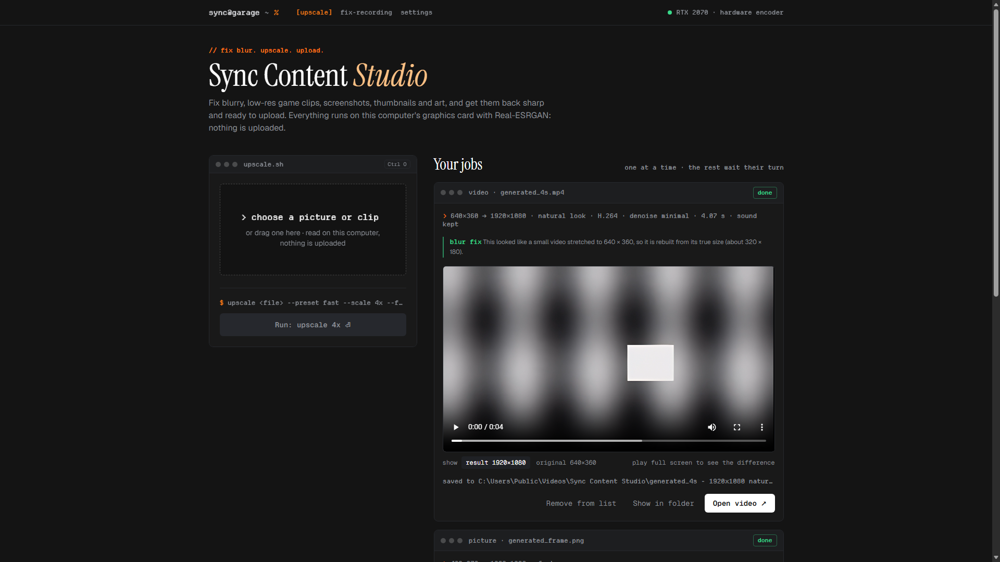
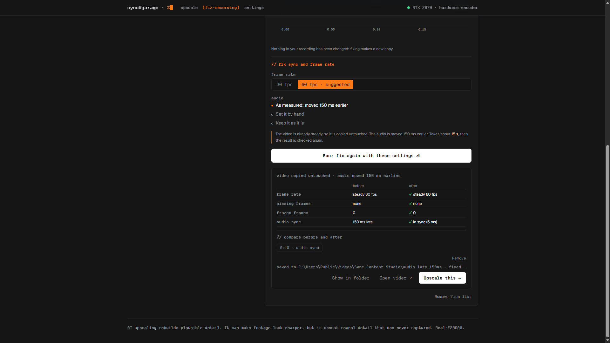

# Sync Content Studio for Windows

Fix blurry, low-res game clips, screenshots, thumbnails and art, upscale them to 4K and make them
ready to upload, on **your own graphics card**. Nothing you open is uploaded anywhere. Free.

**[Download for Windows](https://github.com/SAVATTOR/sync-content-studio/releases/latest/download/SyncContentStudio-Windows.zip)**
(`SyncContentStudio-Windows.zip`, about 250 MB; [all versions](https://github.com/SAVATTOR/sync-content-studio/releases))

## What it does

**Upscale**
- Pictures: Photo, Anime and Fast presets; 1x (fix blur at the same size), 2x or 4x; PNG or JPG.
  Blurry pictures that were stretched from a smaller one are rebuilt from their true size.
- Videos: 720p to 4K, or upload-ready exports for YouTube 4K and 1080p, Shorts/TikTok/Reels (9:16)
  and Instagram (4:5). Natural, Clean and Anime looks, adjustable denoise, H.264 or H.265. The
  original sound and timing are kept.

**Fix My Recording**
- A plain report of frozen and dropped frames, a wobbly frame rate and sound out of sync.
- Fixes them: a steady frame rate, the sound moved back in sync, short freezes redrawn with AI.
- Then send the fixed recording straight to Upscale.

## Start it

1. [Download `SyncContentStudio-Windows.zip`](https://github.com/SAVATTOR/sync-content-studio/releases/latest/download/SyncContentStudio-Windows.zip).
2. Right-click it > **Extract All**, and put the folder somewhere you like (for example Documents).
3. Open the folder and double-click **Sync Content Studio.exe**. The first time, it adds itself to
   the Start menu.

The window opens in Microsoft Edge (without the address bar); closing it closes the app. To remove
the app, delete its folder and its Start menu shortcut.

**If Windows asks before opening it:** "Sync Content Studio.exe" is Python's own starter, signed
by the Python Software Foundation, under the app's name. Choose **More info** > **Run anyway**.

## Your computer

- Windows 10 (version 2004 or later) or Windows 11, 64-bit.
- A graphics card with DirectX 12 (NVIDIA, AMD or Intel) makes it fast. Without one it runs on the
  processor, which is much slower.
- On an RTX 2070 laptop: a 720p clip upscales to 4K at about 5 frames a second (a 10-second clip in
  about a minute).

## Privacy

Everything you open stays on your computer. The app's only connection is a check, when it starts,
for a newer version on this page; it sends nothing about you or your files, and you can switch it
off in Settings.

## More

- Website (pictures in the browser, also on phones): https://savattor--sync-content-studio.modal.run
- AI upscaling rebuilds plausible detail: it can make footage look sharper, but it cannot reveal
  detail that was never captured. Built with Real-ESRGAN and RIFE.
- The app includes open-source parts under their own licences (Python, FFmpeg, Real-ESRGAN,
  Practical-RIFE, ONNX Runtime and others); their texts are in the app's `licences` folder.

© 2026 Austin Nanabenyin Quayson
